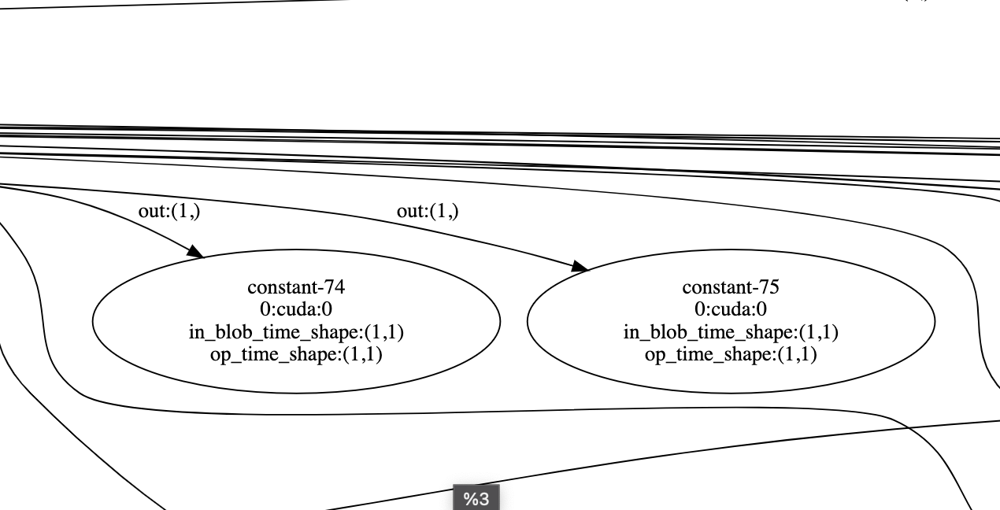
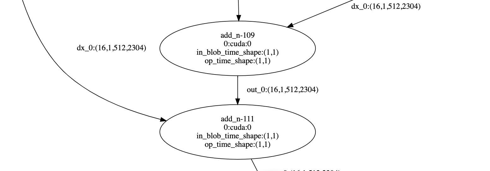

## 解决原版Graph存在的问题

- graph下推导loss的requires_grad=False导致autograd出错

```python
import oneflow as flow


x = flow.randn(2, 3, 4, 5, dtype=flow.float32, device="cuda", requires_grad=True)
y = flow.randn(2, 3, 5, 4, dtype=flow.float32, device="cuda")

m = flow.nn.LayerNorm([3, 4, 4]).to("cuda")
m.train()
of_sgd = flow.optim.SGD(m.parameters(), lr=0.001, momentum=0.9)

class MyGraph(flow.nn.Graph):
  def __init__(self):
    super().__init__()
    self.m = m

  def build(self, x, y):
    t = flow.matmul(x, y)
    t.sum().backward()
    return t

m = MyGraph()
print(m(x, y))
```

## 解决新引入的问题

- 插入pinned_identity防止loss、loss grad和variable grad被优化掉

- 移除为空梯度初始化插入的但未被消费过的constant op

  


- 合并连续的add_n

  因为eager下梯度累加是两两相加，两个以上的梯度累加会分拆成多次add_n来计算。

  
